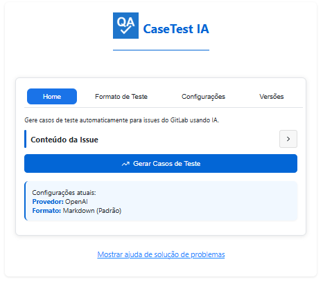

<!-- Redes Sociais -->

  

    
    
    
    
    
  

 

<!-- Seção sobre mim -->
## 🚀 Sobre Mim
<h3>Olá! Sou um Analista de QA com mais de 6 anos de experiência, apaixonado por garantir a qualidade de software e encontrar oportunidades de melhoria. Meu objetivo é contribuir para a entrega de produtos confiáveis e de alta qualidade.</h3>

<!-- GitHub Stats (fallback cards for reliability) -->

  
  
  

<!-- Tecnologias -->
## 🛠️ Tecnologias e Ferramentas

  
  
  
  
  

  
  
  
  
  

  
  
  
  
  

  
  
  
  
  
  

  
  
  

  
  
  
  

  
  

  
  

<!-- Seção de projetos em destaque -->
## 💻 Projetos em Destaque

<h3><b>Clique para ver os Projetos </b></h3>

  

### 🔒 Projeto Privado

 

<table border="0">
<tr>
<td width="50%" valign="top">

**QA-CaseTest-IA**

Extensão Chrome de QA com apoio de IA para acelerar a criação e a execução de casos de teste. Foco em testes de APIs e web, geração inteligente de dados e análise de resultados.

**Recursos principais:**
- ✅ Geração assistida de casos de teste a partir de requisitos
- ✅ Validações inteligentes e relatórios claros para stakeholders
- ✅ Estrutura modular para fácil manutenção e escalabilidade

</td>
<td width="50%" valign="top">

</td>
</tr>
</table>

<!-- Contador de Visitas -->

  

  

 
